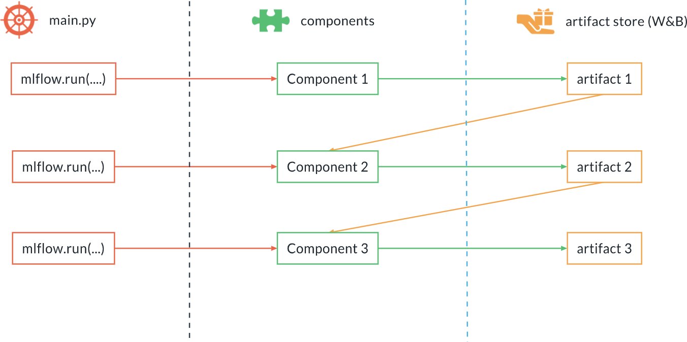
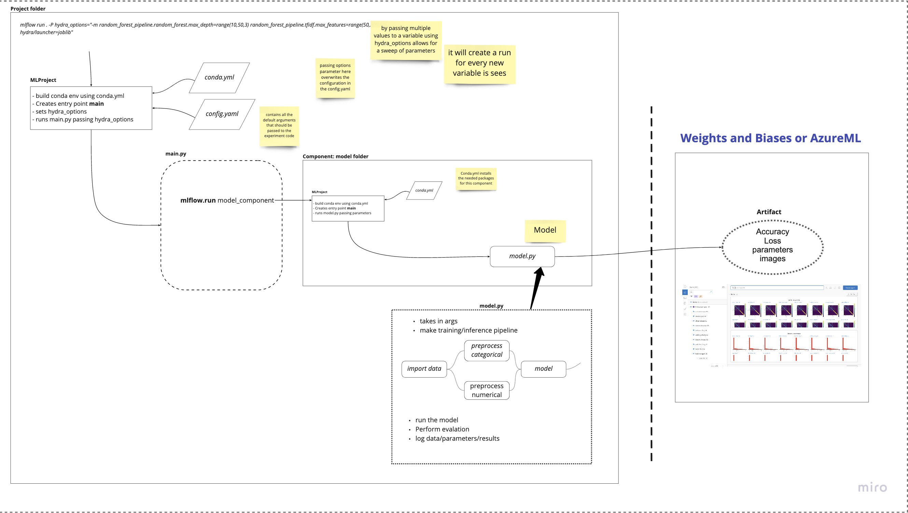

# MLFlow Machine Learning Pipeline Template

## Overview

### Machine Learning Life Cycle:
```md
1. Data collection
2. EDA
3. Data cleaning (not model specific)
4. preprocessing
5. Model training
6. Evaluation
    - - -
7. Deployment
    * Batch: setup environment for periodic runs for throughput
    * Real-time: setup API and environment for reliability
8. Monitoring
    * Performance drop? Repeat step 1
```
- The above list contains the typical steps within the machine learning development life cycle. Most are proficient when it comes to steps 1-6. However, many developers lack experience when it comes to producing the mandatory steps for creating scalable and reproducible machine learning pipelines, which can be deployed and re-trained when needed.

<hr>

## MLFlow project structure:
- In a MLFlow project, you call the `run()` function in order of sequence to the ML life cycle (*roughly*)
- An MLFlow project can be broken into 3 parts:

> 1. Code
> 2. Environment Definition<br>
    - Dependencies <br>
    - Not part of the code <br>
    - YAML file defining environment <br>
    - Can use coda or docker (if you need Kubernetes)
> 3. Project definition<br>
    - Not part of the code<br>
    - Entry points (executables) and some meta data


### Components and Artifacts



Component:
* Action
* They can be scripts, notebooks or executables.

Artifact:
* Output of a component
* Tracked, versioned and stored
* If you do not want to version your data on the cloud, you can use your own database instance and just log the paths in which the versioned data is stored.

## How it looks altogether:



- The above image hows an ML pipeline that has only 1 component, which produces some artifact and versions the artifacts on the cloud.
- This structure allows for modularity and reusability across the project.
- Before adding a new utility or component, you should first produce code within a jupyter notebook in the `/notebooks` folder, which will be reviewed.
- Ideally, you should keep most, if not all, functions within the `/src/_utils` folder.


```powershell
.
├── MLpipeline.md
├── MLproject           # Entrypoint for MLFlow
├── README.md           # Main project doc
├── conda.yml           # main.py conda environment
├── config.yaml         # Configuration file
├── cookie-mlflow-step  # auto-generation of code (don't touch)
│   ├── README.md
│   ├── cookiecutter.json
│   └── {{cookiecutter.step_name}}
│       ├── MLproject
│       ├── conda.yml
│       └── {{cookiecutter.script_name}}
├── notebooks           # Folder for notebooks
│   └── eda
│       └── __init__.py
├── environment.yml     # Base conda development environment
├── main.py             # Main driver script for pipeline
├── resources           # Miscellaneous
│   └── images
│       └── MLFlow_project.jpg
└── src                 # Folder for components
    ├── _utils          # The underlying code used
    │   └── __init__.py
    └── data_extraction # Example component
        ├── MLproject   # Entrypoint for MLFLow for this component
        ├── conda.yml   # conda enivornment for this component
        └── run.py      # script for this component
```


<hr>

## Creating base conda environment
- Firstly we need to create our base conda environment for development.
- Add any dependencies you know you will need in the `environment.yml`

```powershell
conda env create -f environment.yml
conda activate base_project_env
```

<hr>

## Components

### Creating a New Component

- To create a component, run the following command:

```
cookiecutter cookie-mlflow-step -o src
```

- You will then be prompted to provide some input about the component.
For example:

```powershell
step_name [step_name]: basic_cleaning
script_name [run.py]: run.py
job_type [my_step]: basic_cleaning
short_description [My step]: This steps cleans the data
long_description [An example of a step using MLflow and Weights & Biases]: Performs basic cleaning on the data and save the results in Weights & Biases
parameters [parameter1,parameter2]: parameter1,parameter2,parameter3
```

- This will autogenerate a folder within `src` with the step name you provided.
- Within this folder you will see a `run.py`. This is some boilerplate code to help you build out your component
- You will notice that it already has the ability to accept the parameters you specified earlier, and calls the `go()` function.
- Edit this function to perform what the component aims to achieve. You may import utilities from the `/_utils` folder.
    ```python
    os.path.join(root_path, "src", "_utils")
    ```

### Adding a new component to main.py

- In the `config.yaml` file, under `main.execute_steps` add your new component to the list (*make sure your pipeline is in sequential order*)
- Go to `main.py` and add this step to the code
- NOTE: you will need to use different parameters:

```python
if "data_extraction" in steps_to_execute:

    _ = mlflow.run(
        os.path.join(root_path, "src", "data_extraction"),
        "main",
        parameters={
            "file_url": config["data"]["file_url"],
            "artifact_name": "raw_data.parquet",
            "artifact_type": "raw_data",
            "artifact_description": "Data as downloaded"
        },
    )
```

<hr>

## Usage:

### Run entire pipeline

- `cd` to the root diractor
```
mlflow run .
```

### Running the entire pipeline:
- In order to run the pipeline when you are developing, you need to be in the root of the repo folder, then you can execute:

```powershell
mlflow run .
```

- This will run the entire pipeline.

### Running a single step:

- When developing it is useful to be able to run one step at the time. Say you want to run only the download step:

```powershell
mlflow run . -P steps=download
```

### Running multiple steps:
- If you want to run the download and the basic_cleaning steps, you can similarly do:

```powershell
mlflow run . -P steps=download,basic_cleaning
```

### Overwriting config.yml with Hydra
- You can override any other parameter in the `config.yaml` using the Hydra syntax, by providing it as a `hydra_options` parameter.

```powershell
mlflow run . \
  -P steps=train_model \
  -P hydra_options="modeling.random_forest.n_estimators=10"
```

### Hyperparameter Optimization
- Lets say you want to produce model experiments using many different parameters
- This can be accomplished easily by exploiting the Hydra configuration system.
- Use the multi-run feature (adding the `-m` option at the end of the `hydra_options` specification)
- The `range(1,100,2)` function seen below allows you to iterate from 1 to 100 in intervals of 2.
- ***WARNING***: below hypothetical example would produce 150 separate models.

```powershell
mlflow run . \
  -P steps=train_random_forest \
  -P hydra_options="modeling.max_tfidf_features=10,15,30 modeling.random_forest.max_features=range(1,100,2) -m"
```

### Running MLFlow pipeline from Github:
- MLFlow allos you to run pipelines even if you don't have them downloaded locally.
- Go to your repo and create a new release. Tag this release using the [MAJOR.MINOR.PATCH](https://semver.org/) convention of versioning.

```powershell
mlflow run https://github.com/<username>/<repo>.git -v 1.0.0
```

<hr>

## Dependencies:

- See `conda.yml` for individual component dependencies.
- This differs from the `environment.yml`, as the `conda.yml` us whats used by MLFlow at runtime.


<hr>


## Known Issues:

### VSCode terminal:
- If you are using VSCode sometimes the interpreter looks at the wrong instance of python
- make sure you deactivate the default (base) environment before activating the `base_project_env`, or whatever you called your conda env within `environment.yml`


### Removing conda environments created by MLFlow:
- You may want to remove conda environments created by MLFlow as these can pile up. Run these commands to remove them all.

```
for e in $(conda info --envs | grep mlflow | cut -f1 -d" "); do conda uninstall --name $e --all -y;done
```


### Incorrect Python version:
- Sometimes, especially when using VSCode, you make be accidentally using the wrong version of python.
- If a component fails to run due to a `ModuleNotFoundError` or `AttributeError` try adding the python version to the `conda.yaml`

```yaml
dependencies:
  - python=3.8
```
